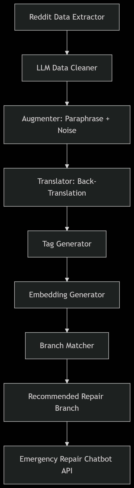

# 🧠 Car Clinic Smart Repair Advisor 🚗🛠️

A fully autonomous, LLM-powered data pipeline that extracts real-world automotive problems from Reddit, cleans, structures, augments, and tags them, then intelligently recommends the most appropriate Car Clinic repair branch using semantic similarity, tags, and location. The system culminates in a real-time LLM-powered Emergency Repair Assistant for customers and mechanics.

---

## 📌 Table of Contents

- [🔎 Project Overview](#-project-overview)
- [🚀 Final Goals](#-final-goals)
- [🏁 Competitors](#-competitors)
- [❗ Challenges Faced](#-challenges-faced)
- [⛔ Project Roadblocks](#-project-roadblocks)
- [💡 Suggested Solutions](#-suggested-solutions)
- [📈 System Architecture](#-system-architecture)
- [🔧 Features](#-features)
- [🧪 Pipeline Phases](#-pipeline-phases)
- [🧬 Data Flow Diagram](#-data-flow-diagram)
- [🗂 Directory Structure](#-directory-structure)
- [📦 Tech Stack](#-tech-stack)
- [🧠 Prompt Engineering Principles](#-prompt-engineering-principles)
- [🗓 Roadmap](#-roadmap)
- [🧾 License](#-license)
- [👨‍💻 Author](#-author)
- [📬 Future Improvements](#-future-improvements)
- [🙋‍♂️ Contributing](#-contributing)
- [📞 Contact](#-contact)

---

## 🔎 Project Overview

**Car Clinic Smart Repair Advisor** is an intelligent, modular system that reads thousands of Reddit threads from car repair subreddits, cleans and structures the data using LLMs, augments and tags content, and then recommends the best-fit repair branch using semantic similarity, embeddings, and geographic filters.

This enables:  
- ⚙️ Real-time, explainable repair suggestions  
- 🤖 LLM inference  
- 🌍 Multilingual data augmentation and understanding  
- 🧭 Nearest optimal repair branch recommendations  
- 💬 An interactive chatbot interface for customers and mechanics  

---

## 🚀 Final Goals

- ✅ Autonomous pipeline: From daily Reddit scraping to real-time recommendations.  
- ✅ LLM processing: Clean noisy car repair data into structured problem–solution pairs.  
- ✅ Semantic tagging and embeddings: Enrich issue understanding and enable vector similarity.  
- ✅ Smart Branch Recommender: Match user problems with the best nearby branch based on tags, embeddings, and availability.  
- ✅ Emergency LLM Chatbot: Provide instant fixes and guidance to mechanics and users in real-time.  
- ✅ API + CI/CD Ready: Modular FastAPI backend with GitHub Actions and Prefect orchestration.  
- ✅ Fully documented: Complete with data samples, diagrams, testing artifacts, and prompt design logic.

---

## 🏁 Competitors

Several projects and platforms tackle automotive problem diagnosis and repair recommendations using AI and data-driven approaches. Notable competitors include:

- **[RepairPal](https://repairpal.com/)**: Offers cost estimates and nearby repair shops but lacks real-time AI-based issue parsing from community data.  
- **[YourMechanic](https://why.yourmechanic.com/)**: Provides on-demand mechanic services and diagnostics but doesn't leverage large-scale social data for problem insights.  
- **[CarMD](https://carmd.com/)**: Focuses on OBD-II diagnostic tools rather than community-driven repair advice.  
- **Open-source automotive chatbot projects**: Most lack integration with live community data sources (e.g., Reddit) and LLM Data Cleaning. Example Project: [car_maintenance_chatbot_project](https://github.com/zebmuhammad/car_maintenance_chatbot_project/tree/main)

---

## ❗ Challenges Faced

- **Data Noise and Quality**: Reddit data contains spam, bot posts, slang, and irrelevant content making cleaning complex.  
- **LLM Offline Processing**: Running large language models locally for data cleaning and understanding requires significant compute and optimization. Therefore leading to other solutions that might be costly.
- **Ollama-Based LLM Processing Time**: Current data cleaning with Ollama-based LLMs, while providing high-quality structured outputs, is time-intensive. For example, processing around 700 rows in Phase 2 can take approximately 31 hours to complete. This runtime presents a bottleneck for scaling and requires optimization or infrastructure improvements to achieve timely data processing.
- **Tagging Consistency**: Creating a comprehensive yet manageable tag schema for diverse car issues and mechanic specialties is difficult.  
- **Semantic Matching Accuracy**: Aligning user problems with correct branches involves fine-tuning embeddings and filter heuristics.  
- **Multilingual and Slang Variations**: Handling multiple languages and informal expressions adds complexity to augmentation and translation.  
- **Integration Complexity**: Combining multiple phases—data extraction, cleaning, tagging, embedding, recommendation, and chatbot—requires robust orchestration.

---

## ⛔ Project Roadblocks

- Limited computational resources for efficient offline LLM inference slowed data cleaning throughput.  
- Incomplete or evolving tag schemas caused misclassification in early testing phases.  
- Integration of real-time chatbot with backend recommender still in prototype stage, delaying deployment.  
- Dataset imbalance due to sparse comments or rare issues affected model generalization.  
- Ongoing challenges in automating end-to-end orchestration with retries and failure handling.

---

## 💡 Suggested Solutions

- **Optimize LLM Models**: Explore quantized models or smaller LLMs with comparable performance to speed up offline inference.
- **Refine Tagging Ontology**: Collaborate with domain experts to finalize tag schema and implement automated tag validation.  
- **Enhance Data Pipeline**: Implement advanced filters and anomaly detection to reduce noise upstream.  
- **Improve Chatbot Integration**: Develop and test API endpoints for seamless real-time interactions and expand frontend support.  
- **Expand Multilingual Support**: Integrate additional language models and fine-tune back-translation workflows.  
- **Robust Orchestration**: Extend Prefect flows with better logging, alerting, and retries to improve pipeline stability.  
- **User Feedback Loop**: Design mechanisms to collect user feedback for continuous model improvements and retraining.  
- **Cloud Deployment Planning**: Prepare for scalable deployment using containerization and managed cloud services.  

---

## 📈 System Architecture

---

## 🔧 Features

- ✅ Daily Reddit data ingestion and pagination handling  
- ✅ LLM-powered structured problem–solution extraction (offline)  
- ✅ Data augmentation: paraphrasing, noise injection, slang simulation  
- ✅ Multilingual support via back-translation  
- ✅ Automatic semantic tagging of problems and solutions  
- ✅ Embedding generation for semantic search (SBERT, Instructor-XL)  
- ✅ Nearest repair branch recommendation based on tags, embeddings, and filters  
- ✅ Modular CLI-compatible pipeline and local chatbot interface  
- ✅ Full orchestration via Prefect and GitHub Actions CI/CD  
- ✅ RESTful API backend with FastAPI  
- ✅ Complete documentation, testing artifacts, and prompt engineering guides  

---

## 🧪 Pipeline Phases

✅ Phase 1: Reddit Data Extraction (Scraping)

- 🔁 **Inputs:**
  - List of subreddits
  - Reddit API credentials (via `praw`)
  - Configs (e.g., number of posts, filters)

- ⚙️ **Inside:**
  - Fetch top daily/weekly posts with comments
  - Remove posts with no comments
  - Filter spam/bot content
  - Save results in `/data/raw/` as JSON or CSV

- 🎯 **Purpose:**  
  Collect relevant raw text data (real-world issues and discussions) for downstream LLM processing.

- 🔁 **Used again in:**  
  Phase 2 (Cleaning), Phase 10 (Re-training or evaluation for LLMs)

- 📤 **Outputs:**  
  `/data/raw/reddit_posts_with_comments.json`

✅ Phase 2: Reddit Data Cleaning (LLM-Based)

- 🔁 **Inputs:**  
  - Raw Reddit posts + top comments  
  - LLM model (offline or Ollama)  
  - Prompt template

- ⚙️ **Inside:**  
  - Preprocessing: Remove bots, normalize text  
  - LLM Inference: Extract (problem → solution) pairs using prompts  
  - Postprocessing: JSON formatting, hallucination checks, null handling

- 🎯 **Purpose:**  
  Converts noisy internet content into clean problem–solution pairs for chatbot and tagging.

- 🔁 **Used again in:**  
  Phase 3 (Tag Generation), Phase 9 (LLM chatbot fine-tuning)

- 📤 **Outputs:**  
  `/data/cleaned/cleaned_problems_solutions.json`

🦑 Phase 3: Data Augmentation & Translation

- 🔁 **Inputs:**  
  - Cleaned problem–solution pairs  
  - NLPAug/TextAttack or offline LLMs for paraphrasing  
  - Optional translation APIs or offline models  
  - Noise injection rules (typos, slang)

- ⚙️ **Inside:**  
  - Paraphrasing: Generate 1–3 semantically similar versions  
  - Translation: Translate → Back-translate (e.g., EN → AR → EN)  
  - Noise Injection: Add typos, abbreviations  
  - Flow management: `augmenter/flow.py`, `translator/flow.py`

- 🎯 **Purpose:**  
  Increase data diversity and robustness to phrasing variability and multilingual input.

- 🔁 **Used again in:**  
  Phase 5 (Embedding generation), Phase 10 (Chatbot understanding)

- 📤 **Outputs:**  
  `/data/augmented/augmented_problems_solutions.json`

🌿 Phase 4: Tag Generator (Problem + Solution Tags)

- 🔁 **Inputs:**  
  - Cleaned or augmented problem–solution pairs  
  - Tagging rules or LLM model  
  - Optional keyword dictionaries or tag schemas

- ⚙️ **Inside:**  
  - Extract semantic tags from problems and solutions  
  - Track source (rule-based, LLM, or hybrid)  
  - Store metadata like confidence, LLM version  
  - Orchestrated via `tag_generator/flow.py`

- 🎯 **Purpose:**  
  Enables structured understanding for tag-based filtering and scoring in recommendations.

- 🔁 **Used again in:**  
  Phase 6 (Tag-based matching), Phase 10 (Chatbot explanations)

- 📤 **Outputs:**  
  `/data/tagged/tagged_problems_solutions.json`

🔢 Phase 5: Embedding Generation (Problems + Branches)

- 🔁 **Inputs:**  
  - Cleaned/tagged problem–solution pairs  
  - Branch expertise descriptions  
  - Pretrained embedding model (e.g., Sentence-BERT, Instructor-XL)

- ⚙️ **Inside:**  
  - Vectorize problem–solution pairs  
  - Vectorize branch expertise profiles  
  - Store embeddings separately (`/data/embeddings/problems/`, `/data/embeddings/branches/`)  
  - Auto-skip already embedded entries  
  - Freeze model versions & store hashes  
  - Flow handled by `embedding_generator/flow.py`

- 🎯 **Purpose:**  
  Enables similarity-based retrieval and matching for hybrid recommendations.

- 🔁 **Used again in:**  
  Phase 6 (Similarity scoring), Phase 10 (Chatbot reasoning)

- 📤 **Outputs:**  
  `/data/embeddings/problems/*.npy`, `/data/embeddings/branches/*.npy`

🗺️ Phase 6: Branch Recommender System

- 🔁 **Inputs:**  
  - Tagged problems  
  - Problem embeddings  
  - Branch embeddings + tag profiles  
  - Branch availability + location (optional)

- ⚙️ **Inside:**  
  - Match tags (e.g., Jaccard Index)  
  - Match vectors (cosine similarity)  
  - Apply location filter if coordinates provided  
  - Composite scoring: weighted formula of tags, embeddings, location  
  - Return top-N recommendations with explainability logs  
  - Flow: `branch_recommender/flow.py`

- 🎯 **Purpose:**  
  Core logic to choose the best-fit repair branch per user query.

- 🔁 **Used again in:**  
  Phase 10 (Chatbot resolution), Phase 11 (Backend endpoint)

- 📤 **Outputs:**  
  `/data/recommendations/top_branches_for_postid.json`

🧪 Phase 7: Local & Integrated Testing

- 🔁 **Inputs:**  
  - Outputs from previous phases  
  - Small manually crafted test batch  
  - Expected results/ground truth (if available)

- ⚙️ **Inside:**  
  - Run unit tests per script  
  - Run integration tests on test batch  
  - Visualize embeddings, matches, tags  
  - Store snapshots in `/docs/test_cases/`

- 🎯 **Purpose:**  
  Verify correctness and integration before scaling.

- 🔁 **Used again in:**  
  Phase 12 (Documentation), CI/CD (Phase 9)

- 📤 **Outputs:**  
  `/docs/test_cases/*.json`, `/docs/test_results/`, visuals

🌀 Phase 8: Prefect Orchestration

- 🔁 **Inputs:**  
  - All flow.py scripts (Phases 1–6)  
  - Prefect config (retry, logging)  
  - Optional Prefect Cloud credentials

- ⚙️ **Inside:**  
  - Convert scripts to Prefect tasks  
  - Chain tasks in logical order  
  - Add retries, error handlers, logging  
  - Trigger from CLI or schedule

- 🎯 **Purpose:**  
  Automate and connect pipeline parts in modular robust system.

- 🔁 **Used again in:**  
  Phase 9 (CI/CD), Phase 11 (Runtime scheduling)

- 📤 **Outputs:**  
  Prefect DAG, CLI runnable flows, logs

☁️ Phase 9: GitHub Actions & Deployment

- 🔁 **Inputs:**  
  - GitHub repo + workflows  
  - Prefect-compatible flows  
  - Secrets (.env or GitHub Secrets)

- ⚙️ **Inside:**  
  - Run flows (scraping, cleaning, tagging, embedding, matching)  
  - Scheduled daily (e.g., 12:15 PM Egypt time)  
  - Support matrix builds and parallelization  
  - Optional Docker container builds

- 🎯 **Purpose:**  
  Fully automated data ingestion & processing pipeline on GitHub infrastructure.

- 🔁 **Used again in:**  
  All phases (1–6), redeployment on code updates

- 📤 **Outputs:**  
  Daily updated `/data/`, GitHub CI logs, optional Docker images

📘 Phase 10: LLM Chatbot Engine

- 🔁 **Inputs:**  
  - User query (via REST API)  
  - Cleaned + tagged Reddit problems  
  - Embeddings (problems & branches)  
  - Branch metadata (tags, location)

- ⚙️ **Inside:**  
  - Classify query intent  
  - Retrieve similar Reddit cases  
  - LLM generates structured response  
  - Match to branch via Phase 6 logic  
  - Format JSON response for chatbot

- 🎯 **Purpose:**  
  Frontline AI interaction interface.

- 🔁 **Used again in:**  
  Phase 11 (API routes), Phase 12 (docs)

- 📤 **Outputs:**  
  Structured JSON `{ "solution": ..., "branch": ..., "confidence": ... }`

🚪 Phase 11: Backend Integration (FastAPI)

- 🔁 **Inputs:**  
  - Chatbot logic (Phase 10)  
  - Recommender logic (Phase 6)  
  - Processed data (embeddings, tags)  
  - API config & schema

- ⚙️ **Inside:**  
  - REST endpoints: `/chat/solve`, `/recommend/branch`  
  - Parse inputs, run logic, return JSON  
  - Dockerized for modular deployment  
  - Optional Redis caching

- 🎯 **Purpose:**  
  Expose system via API for production apps.

- 🔁 **Used again in:**  
  Real-time deployment, frontend integration

- 📤 **Outputs:**  
  `main.py` FastAPI server, OpenAPI docs

📘 Phase 12: Documentation & Finalization

- 🔁 **Inputs:**  
  - All code, flows, configs, data samples  
  - Testing results (Phase 7)  
  - Model & LLM choices

- ⚙️ **Inside:**  
  - Create README, architecture diagrams  
  - Document phases and modules  
  - Glossary, schema definitions  
  - Data samples & test outputs

- 🎯 **Purpose:**  
  Make pipeline shareable, reproducible, production-ready.

- 🔁 **Used again in:**  
  Onboarding, public release, presentations

- 📤 **Outputs:**  
  `/docs/`, `README.md`, diagrams, prompt designs, schema

---

## 🧬 Data Flow Diagram

  

---

## 🗂 Directory Structure

- car_clinic_chatbot/
  - .github/  # GitHub configuration folder for workflows and automation
    - workflows/  # Contains CI/CD and scheduled workflow definitions
      - main.yaml  # Main GitHub Actions workflow for CI/CD and scheduling

  - README.md  # Project overview, setup instructions, usage, and documentation
  - requirements.txt  # Python dependencies and package list for environment setup
  - Dockerfile  # Docker configuration to containerize the application
  - docker-compose.yml  # Optional file for orchestrating multiple containers/services
  - .env  # Environment variables file (excluded from version control)
  - .gitignore  # Lists files/folders to ignore in git commits (e.g., secrets, temp files)

  - main.py  # Main entry point script for running the FastAPI backend service
  - prefect_flows.py  # Prefect orchestration script managing workflow execution
  - llm_prompt_templates.py  # Centralized storage of reusable prompt templates for LLM calls

  - config/  # Configuration files and settings for the project
    - settings.py  # Central config: paths, API keys, global options

  - scripts/  # Miscellaneous one-off or utility scripts for manual testing or dev
    - run_cleaning_locally.py  # Script to run data cleaning pipeline locally for testing
    - generate_embeddings_once.py  # One-time embeddings generation utility script
    - dev_debug_utils.py  # Developer utilities for debugging or inspecting data

  - logs/  # Folder for storing local logs (e.g., pipeline execution logs)
    - pipeline.log  # Log file for pipeline runs (if not using remote logging)

  - notebooks/  # Jupyter notebooks for exploration, prototyping, and experimentation
    - llm_prompt_tuning.ipynb  # Notebook focused on tuning and testing LLM prompts
    - sample_reddit_analysis.ipynb  # EDA notebook analyzing sample Reddit data
    - tagging_experiments.ipynb  # Notebook testing and experimenting with tagging strategies

  - data/  # All datasets, intermediate, and processed data stored here
    - raw/  # Raw unprocessed Reddit posts and comments
    - cleaned/  # Data cleaned and structured into problem–solution pairs
    - augmented/  # Augmented data with paraphrases, translations, noise injection
    - tagged/  # Data with semantic tags applied (problems, solutions, components)
    - embeddings/  # Embedding vectors for semantic similarity and recommendations
      - problems/  # Embeddings representing user-reported issues
      - branches/  # Embeddings representing Car Clinic branch expertise profiles
    - examples.jsonl  # Labeled examples for development, debugging, or training validation

  - python_scripts/  # Core modular pipeline components implemented as Python packages
    - reddit_data_extractor/  # Extracts and scrapes Reddit data
      - __init__.py  # Package initializer
      - config.py  # Extractor-specific configurations
      - extractor.py  # Main extraction logic from Reddit API
      - extractor_Base.py  # Base or initial version of the code (NON MODULARIZED)
      - flow.py  # Orchestration flow for data extraction
      - reddit_client.py  # Wrapper/client for Reddit API interactions
      - scraper.py  # Web scraping utilities if applicable
      - writer.py  # File writing and storage utilities
      - utils.py  # Helper functions and utilities for extraction

    - reddit_data_cleaner/  # Cleans and structures raw Reddit data
      - __init__.py  # Package initializer
      - flow.py  # Orchestration flow for data cleaning
      - cleaner.py  # Core cleaning logic and transformations
      - llm_cleaner.py  # Local LLM-based cleaning for testing with sample prompts, SKIPPED BECAUSE OF THE LIMITED COMPUTATIONAL RESOURCES
      - llm_runner.py  # LLM execution engine for inference calls
      - preprocessor.py  # Text preprocessing utilities (e.g., normalization, bot removal)
      - postprocessor.py  # Postprocessing to fix JSON, handle nulls, remove hallucinations
      - utils.py  # Helper utilities specific to cleaning

    - data_augmenter/  # Augmentation of cleaned data (paraphrasing, translation, noise)
      - __init__.py  # Package initializer
      - flow.py  # Orchestration flow for data augmentation
      - paraphraser.py  # Generates paraphrased sentence variants
      - translator.py  # Translation and back-translation handling
      - noise_injector.py  # Adds typos, slang, and noise to simulate real input
      - utils.py  # Helper functions for augmentation
      - config.py  # Augmentation-specific configuration parameters

    - tag_generator/  # Generates semantic tags from problems and solutions
      - __init__.py  # Package initializer
      - flow.py  # Orchestration flow for tagging process
      - tagger.py  # Tag extraction and assignment logic
      - constants.py  # Tagging rules, enums, constants
      - utils.py  # Tagging utility functions

    - embedding_generator/  # Creates embeddings for problems and branches
      - __init__.py  # Package initializer
      - flow.py  # Orchestration flow for embedding generation
      - embedder.py  # Embedding model wrapper and vectorization logic
      - utils.py  # Embedding utility functions
      - config.py  # Embedding-related config (models, parameters)

    - branch_recommender/  # Matches problems to best repair branches
      - __init__.py  # Package initializer
      - flow.py  # Orchestration flow for branch recommendation
      - matcher.py  # Core matching algorithms and similarity scoring
      - filters.py  # Filtering logic (location, availability)
      - utils.py  # Helper functions for recommendation process
      - ranker.py  # Ranking and scoring of candidate branches

  - chatbot/  # Backend logic for chatbot interactions and response generation
    - query_classifier.py  # Classifies user input into intent/problem categories
    - retriever.py  # Retrieves relevant past cases or FAQs for context
    - reasoner.py  # Final LLM-based reasoning and response generator
    - branch_suggester.py  # Suggests branches based on embedding similarity
    - formatter.py  # Formats chatbot responses into user-friendly output
    - fallback.py  # Handles errors, fallback scenarios, and edge cases

  - api/  # FastAPI backend API implementation and endpoints
    - routes/  # API route handlers
      - chat.py  # Chat endpoint for user queries
      - recommend.py  # Branch recommendation API endpoint
    - models.py  # Pydantic data models for request/response validation
    - dependencies.py  # Shared dependencies, middleware, security utilities
    - server.py  # FastAPI app instance and server launch script

  - tests/  # Automated test suite for unit and integration tests
    - conftest.py  # Shared pytest fixtures and setup code
    - unit/  # Unit tests for isolated functions/modules
      - test_cleaner.py  # Tests for data cleaning functions
      - test_embedder.py  # Tests for embedding generation modules
      - ...  # Other unit tests
    - integration/  # Integration tests for multi-module workflows
      - test_end_to_end_pipeline.py  # Full pipeline test case
      - ...  # Other integration tests
    - test_data/  # Sample test input and expected output data files
      - sample_raw.json  # Raw Reddit data sample for testing
      - expected_cleaned.json  # Expected cleaned output for comparison

  - extra_scripts/  # Additional standalone Python utilities (non-packaged)
    - Token Counter and Cost Approximator  # Utility for token counting and cost estimation
    - Parquet Transformer  # Utility for transforming data into Parquet format
    - Merge Mail Maker  # Utility to generate merged emails or reports

  - docs/  # Documentation and visual assets for the project
    - architecture_diagram.png  # System architecture diagram image
    - dag_flow.png  # Directed Acyclic Graph flow diagram image
    - embedding_guide.md  # Documentation on embedding techniques used
    - branch_matching.md  # Documentation on branch matching logic
    - api_schema.md  # API schema documentation for endpoints
    - sample_output_examples.md  # Examples of expected system output JSONs

---

## 📦 Tech Stack

| Category        | Tool / Library                |
|-----------------|------------------------------|
| Data Source     | Reddit (PRAW, HTTPX)         |
| LLM             | Ollama hosted on GitHub      |
| Embedding Models| SBERT, Instructor-XL         |
| Tagging         | LLM-driven & rule-based      |
| Workflow        | Prefect + GitHub Actions     |
| API Backend     | FastAPI, Pydantic            |
| Scraping        | PRAW, HTTPX                  |
| Containerization| Docker, Docker Compose       |
| Language        | Python 3.10+                 |
| Storage         | GitHub, PostgreSQL(Future)   |

---

## 🧠 Prompt Engineering Principles

- Clear role and intent definitions  
- JSON-structured outputs for consistent parsing  
- Resistant to hallucinations with carefully designed examples  
- Few-shot learning and instruction-based prompts  
- Flexible for multi-language support and augmentation

See [docs/prompt_templates.pdf](/docs/prompt_templates.pdf) for detailed templates.

---

## 🗓 Roadmap

| Stage                                              | Start Date  | End Date    | Status   |
|----------------------------------------------------|-------------|-------------|----------|
| Automated Reddit data extraction                   | 2025-01-05  | 2025-01-10  | ✅ Done  |
| Offline LLM-powered data cleaning and parsing      | 2025-01-11  | 2025-01-25  | ✅ Done  |
| Semantic tagging and schema design                 | 2025-01-26  | 2025-02-01  | ✅ Done  |
| Embedding generation and similarity matching       | 2025-02-02  | 2025-02-05  | ✅ Done  |
| Branch recommender system integration              | 2025-02-06  | 2025-02-10  | ✅ Done  |
| GitHub CI/CD with Prefect orchestration            | 2025-02-11  | 2025-02-15  | ✅ Done  |
| REST API endpoints (FastAPI)                       | 2025-02-16  | 2025-02-20  | 🔄 In Progress |
| Interactive frontend UI (optional)                 | 2025-02-21  | 2025-02-28  | 🔄 Planned |
| Docker-based deployment                            | 2025-03-01  | 2025-03-03  | 🔄 Planned |
| Support for Arabic and Spanish languages           | 2025-03-04  | 2025-03-10  | 🔄 Planned |

